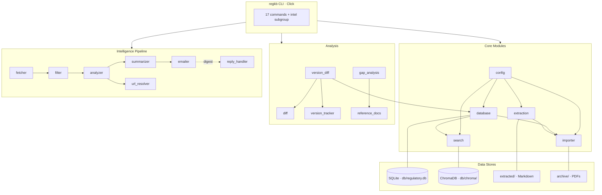
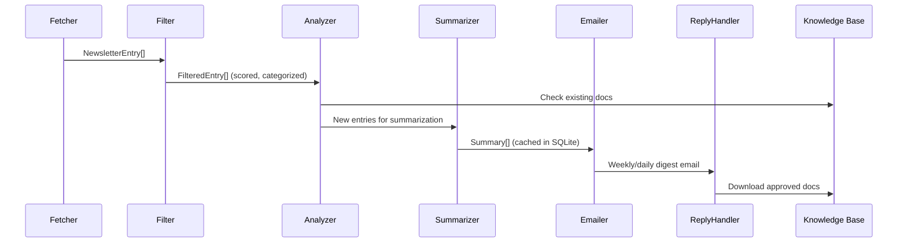
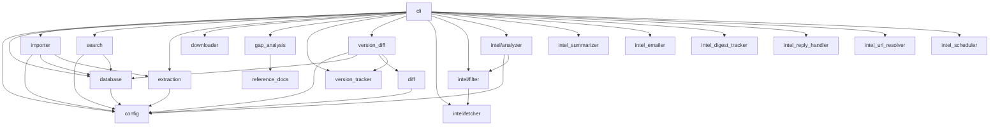

# CLAUDE.md — RegulatoryKB

Medical device regulatory affairs knowledge base. Python 3.9+ · Click CLI · SQLite + ChromaDB · PDF extraction with OCR · regulatory intelligence pipeline.

## File Map

### Root

| File | Lines | Purpose |
|------|------:|---------|
| `pyproject.toml` | 105 | Build config, deps, tool settings (Black, Ruff, MyPy, pytest) |
| `.pre-commit-config.yaml` | 16 | Ruff + format + whitespace + YAML + large-file hooks |
| `setup.py` | 11 | Shim for `pip install -e .` |
| `config/config.yaml` | 306 | Runtime config: paths, doc types, jurisdictions, OCR, intelligence |

### `scripts/regkb/` — Core Package

| File | Lines | Purpose |
|------|------:|---------|
| `cli.py` | 2677 | Click CLI — 18 commands + `intel` subgroup (17 subcommands) |
| `config.py` | 297 | Singleton config manager; loads YAML, validates/normalizes types + jurisdictions |
| `database.py` | 485 | SQLite manager with FTS5 full-text search, CRUD, import batch tracking |
| `search.py` | 313 | Dual search: SQLite FTS5 + ChromaDB semantic vector search |
| `importer.py` | 415 | Import workflow: dedup, validation, text extraction, batch audit |
| `extraction.py` | 303 | PDF→Markdown via PyMuPDF; OCR fallback via pytesseract |
| `downloader.py` | 252 | HTTP document fetcher with URL validation and filename sanitization |
| `diff.py` | 310 | Document comparison: unified diff, HTML side-by-side, similarity stats, export (CSV/MD/HTML) |
| `version_tracker.py` | 448 | Version checking against `KNOWN_VERSIONS` dict; current/outdated/unknown |
| `version_diff.py` | 296 | Auto-detect prior versions of imported docs and generate diffs |
| `gap_analysis.py` | 324 | Compare KB against reference checklist; identifier matching + scoring |
| `reference_docs.py` | 953 | Curated checklist of essential regulatory documents by jurisdiction |
| `acquisition_list.py` | 880 | Acquisition URLs for missing docs by jurisdiction + priority |

### `scripts/regkb/web/` — FastAPI Web UI

| File | Lines | Purpose |
|------|------:|---------|
| `main.py` | 69 | FastAPI app, session middleware, route registration (documents before browse for /add) |
| `dependencies.py` | 55 | DI functions (get_db, get_search_engine), flash messages |
| `routes/search.py` | 125 | Search page with HTMX live results |
| `routes/browse.py` | 145 | Document list, detail view, PDF download, text view |
| `routes/documents.py` | 185 | Upload PDF (with validation), import from URL, folder import, metadata edit |
| `routes/diff.py` | 110 | Document comparison with side-by-side HTML diff, export (CSV/MD/HTML) |
| `routes/versions.py` | 47 | Version status dashboard (current/outdated/unknown) |
| `routes/gaps.py` | 140 | Gap analysis dashboard with jurisdiction drill-down, CSV export |
| `routes/intel.py` | 273 | Intelligence pipeline: pending queue, approve/reject, digests, fetch/sync |
| `routes/admin.py` | 288 | Statistics, settings, backup, reindex, batch operations (re-extract, metadata) |
| `templates/` | 18 files | Jinja2: base, search, browse, detail, add, diff, versions, gaps, intel, batch, stats, settings + partials |
| `static/` | 3 files | Pico CSS, custom.css, htmx.min.js |

### `scripts/regkb/intelligence/` — Monitoring Pipeline

| File | Lines | Purpose |
|------|------:|---------|
| `fetcher.py` | 330 | Fetch regulatory updates from Index-of-Indexes CSV sources |
| `filter.py` | 567 | Relevance scoring by keywords, categories, alert level |
| `analyzer.py` | 544 | Compare filtered entries against KB; manage download queue |
| `summarizer.py` | 403 | LLM-powered summaries via Claude API; SQLite cache |
| `emailer.py` | 848 | SMTP digest delivery (weekly/daily/reply-confirmation templates) |
| `digest_tracker.py` | 452 | Deduplication across weekly/daily/monthly digests |
| `url_resolver.py` | 400 | Resolve shortened links; verify document accessibility |
| `reply_handler.py` | 557 | Poll IMAP inbox for email replies; queue docs for download |
| `scheduler.py` | 376 | Windows Task Scheduler XML + batch script generation |

### `tests/`

| File | Lines | Purpose |
|------|------:|---------|
| `conftest.py` | 61 | Fixtures: `fresh_config`, `tmp_db`, `populated_db` |
| `test_config.py` | 94 | Config singleton, validation, normalization |
| `test_database.py` | 115 | CRUD, FTS5 search, statistics, import batches |
| `test_gap_analysis.py` | 192 | Title normalization, identifier extraction, match scoring |
| `test_version_tracker.py` | 179 | Version extraction, doc identifier normalization, status checks |
| `test_diff.py` | 66 | Diff stats, unified diff, HTML diff |
| `test_extraction.py` | 73 | Markdown conversion, heading/list detection |
| `test_downloader.py` | 76 | URL validation, filename sanitization |

## Architecture



## Intelligence Pipeline



## Module Dependencies



## Key Commands

```bash
pip install -e ".[dev]"       # Dev install (pytest, black, ruff, mypy)
pip install -e ".[ocr]"       # OCR support (pytesseract, Pillow)
pip install -e ".[web]"       # Web UI (FastAPI, uvicorn, jinja2)
regkb --help                  # CLI entry point
regkb web --reload            # Start web UI at http://127.0.0.1:8000
pytest                        # Run tests (verbose, short tracebacks)
pre-commit run --all-files    # Lint/format check
```

## Windows Service Setup

Always-on web UI via NSSM (Non-Sucking Service Manager).

**Install service (run as Administrator):**
```
1. winget install NSSM.NSSM
2. scripts\install-all-deps-global.bat   # Install deps to system Python
3. scripts\install-service.bat           # Create & start service
4. scripts\fix-pythonpath.bat            # Set PYTHONPATH for service
```

**Service management:**
```
nssm status RegKBWeb      # Check status
nssm restart RegKBWeb     # Restart
nssm stop RegKBWeb        # Stop
nssm start RegKBWeb       # Start
nssm edit RegKBWeb        # Edit config (GUI)
```

| Item | Value |
|------|-------|
| URL | http://127.0.0.1:8000 |
| Service name | RegKBWeb |
| Logs | `logs/service.log` |
| Auto-start | Yes (on boot) |
| Auto-restart | Yes (on crash) |

**Uninstall:** `scripts\uninstall-service.bat` (as Administrator)

## Data Stores

| Store | Location | Purpose |
|-------|----------|---------|
| SQLite | `db/regulatory.db` | Structured metadata + FTS5 full-text search |
| ChromaDB | `db/chroma/` | Vector embeddings for semantic search |
| Extracted text | `extracted/` | PDF→Markdown extraction output |
| PDF archive | `archive/` | Source documents, organized by jurisdiction subdirs |

## Database Schema

| Table | Key Columns | Notes |
|-------|-------------|-------|
| `documents` | id · hash(UNIQUE) · title · document_type · jurisdiction · version · is_latest · file_path · extracted_path · extracted_text · description · download_date · import_date · superseded_by(FK) | Main document store |
| `documents_fts` | title · description · extracted_text | FTS5 virtual, `content='documents'`, porter tokenizer |
| `import_batches` | id · source_path · started_at · completed_at · total_files · imported · duplicates · errors · status | Audit trail |
| `import_batch_items` | id · batch_id(FK) · file_path · document_id(FK) · status · error_message | Per-file tracking |

Indexes: `hash` · `document_type` · `jurisdiction` · `is_latest`. Triggers: `documents_ai`/`ad`/`au` keep FTS5 in sync.

## Data Models

**Core:**

- `DiffStats(added · removed · changed · unchanged: int, similarity: float)` — `.summary() -> str` · `.total -> int`
- `DiffResult(doc1_id · doc2_id: int, doc1_title · doc2_title: str, stats: DiffStats, unified_diff · html_diff: str)`
- `VersionInfo(doc_id: int, title · jurisdiction: str, current_version · latest_version · current_date · latest_date: str?, is_current: bool, status · notes · update_url: str)`
- `VersionDiffResult(new_doc_id · old_doc_id: int, old_doc_title · new_doc_title: str, stats: DiffStats, diff_html_path · error: str?, auto_superseded: bool)`
- `MatchResult(ref_id · ref_title · ref_description · jurisdiction · category: str, mandatory · matched: bool, kb_doc_id: int?, kb_doc_title: str?, match_confidence: float)`
- `ImportResult(total_files · imported · duplicates · errors: int, error_details: list[dict])`

**Intelligence:**

- `NewsletterEntry(date · agency · category · title: str, link: str?, date_parsed: datetime?)`
- `FetchResult(total_entries · sources_fetched: int, entries: list, errors: list[str], fetch_time: datetime?)`
- `FilteredEntry(entry: NewsletterEntry, relevance_score: float, matched_keywords · matched_categories: list[str], is_combination_device: bool, alert_level: str?)`
- `FilterResult(entries: list, total_entries · alerts · high_priority: int)`
- `AnalysisResult(entry: FilteredEntry, in_kb · is_downloadable · requires_manual: bool, kb_doc_id: int?, kb_match_type · manual_reason · download_url: str?, kb_match_score: float)`
- `AnalysisSummary(total_analyzed · already_in_kb · new_downloadable · requires_manual: int, results: list)`
- `PendingDownload(id: int, title · url · agency · category · date · status · created_at · updated_at: str, relevance_score: float, keywords: list[str], doc_id: int?)`
- `Summary(entry_title · entry_agency · entry_date · what_happened · why_it_matters · action_needed · full_summary · generated_at · model_used: str)`
- `EmailConfig(smtp_server: str, smtp_port: int, sender: str, recipients: list[str], username · password: str?, use_tls: bool)`
- `EmailResult(success: bool, recipients_sent: int, error: str?)`
- `DigestEntry(entry_id · entry_hash · title · agency · category · date · download_status: str, link · resolved_url · error_message: str?, kb_doc_id: int?)`
- `Digest(digest_date: str, sent_at: datetime, entry_count: int, message_id: str?)`
- `ResolveResult(success · is_paid · needs_manual: bool, original_url: str, resolved_url · document_type · domain · error: str?, all_links_found: list?)`
- `DownloadRequest(entry_ids: list[str], requester_email · subject · raw_body: str, received_at: datetime)`
- `ProcessedDownload(entry: DigestEntry, success · needs_manual_url: bool, kb_doc_id: int?, resolved_url · error · content_warning: str?, version_diff: object?)`
- `ProcessingResult(requests_processed: int, successful · failed · needs_manual: list, errors: list[str])`

## Module API Reference

### config.py — `Config` (singleton)

| Method | Signature |
|--------|-----------|
| `validate_document_type` | `(doc_type: str) -> tuple[bool, str]` |
| `validate_jurisdiction` | `(jurisdiction: str) -> tuple[bool, str]` |
| `normalize_document_type` | `(doc_type: str) -> str` |
| `normalize_jurisdiction` | `(jurisdiction: str) -> str` |
| `get` | `(key: str, default=None) -> Any` — dot-notation supported |
| `reload` | `() -> None` |
| Properties | `base_dir · archive_dir · extracted_dir · database_path · backups_dir · logs_dir · pending_dir · diffs_dir · document_types · jurisdictions` |

### database.py — `Database(db_path: Path?)`

| Method | Signature |
|--------|-----------|
| `connection` | `() -> Generator[Connection]` — context manager |
| `document_exists` | `(file_hash: str) -> bool` |
| `add_document` | `(file_hash, title, document_type, jurisdiction, file_path, version?, source_url?, description?, download_date?) -> int` |
| `get_document` | `(doc_id?: int, file_hash?: str) -> dict?` |
| `update_document` | `(doc_id: int, **kwargs) -> bool` — allowed: title · document_type · jurisdiction · version · is_latest · source_url · description · extracted_path · extracted_text · superseded_by |
| `list_documents` | `(document_type?, jurisdiction?, latest_only=True, limit=100, offset=0) -> list[dict]` |
| `search_fts` | `(query: str, limit=10, latest_only=True) -> list[dict]` |
| `get_statistics` | `() -> dict` — keys: total_documents · by_type · by_jurisdiction · latest_versions · total_imports |
| `create_import_batch` | `(source_path: str) -> int` |
| `update_import_batch` | `(batch_id, total_files?, imported?, duplicates?, errors?, status?) -> None` |
| `backup` | `() -> Path` |

### search.py — `SearchEngine()`

| Method | Signature |
|--------|-----------|
| `index_document` | `(doc_id: int, text: str, metadata: dict) -> bool` |
| `search` | `(query, limit=10, document_type?, jurisdiction?, latest_only=True, include_excerpt=True) -> list[dict]` |
| `reindex_all` | `(progress_callback?) -> int` |

### extraction.py — `TextExtractor(output_dir: Path?)`

| Method | Signature |
|--------|-----------|
| `extract` | `(pdf_path: Path, doc_id: int, force_ocr=False) -> tuple[bool, Path?, str?]` |
| `re_extract` | `(pdf_path: Path, doc_id: int, force_ocr=False) -> tuple[bool, Path?, str?]` |
| `get_extracted_text` | `(doc_id: int) -> str?` |
| `_convert_to_markdown` | `(text: str, title: str) -> str` |
| `_is_potential_heading` | `(line: str) -> bool` |
| `_is_list_item` | `(line: str) -> bool` |
| `_format_list_item` | `(line: str) -> str` |

### importer.py — `DocumentImporter()`

| Method | Signature |
|--------|-----------|
| `import_directory` | `(source_dir, recursive=True, metadata_callback?, progress=True) -> ImportResult` |
| `import_file` | `(file_path, metadata?) -> int?` |
| `import_from_url` | `(url, metadata?) -> int?` |
| `scan_directory` | `(directory, recursive=True) -> list[Path]` |
| `is_valid_pdf` | `(file_path) -> tuple[bool, str]` |
| `calculate_hash` | `(file_path) -> str` |

### downloader.py — `DocumentDownloader()`

| Method | Signature |
|--------|-----------|
| `download` | `(url, title, jurisdiction, timeout=60) -> tuple[bool, Path?, str?]` |
| `download_batch` | `(documents, progress_callback?, delay=1.0) -> dict` |
| `_validate_url` | `(url: str) -> tuple[bool, str?]` |
| `_sanitize_filename` | `(filename: str) -> str` |

### diff.py — Pure functions

| Function | Signature |
|----------|-----------|
| `compare_documents` | `(doc1_id, doc2_id, doc1_title="", doc2_title="", context_lines=3, include_html=False) -> DiffResult?` |
| `compute_diff_stats` | `(lines1, lines2: list[str]) -> DiffStats` |
| `generate_unified_diff` | `(lines1, lines2, label1, label2, context_lines=3) -> str` |
| `generate_html_diff` | `(lines1, lines2, label1, label2, context_lines=3) -> str` |
| `export_diff_csv` | `(result: DiffResult) -> str` — CSV with metadata, stats, change summary |
| `export_diff_markdown` | `(result: DiffResult) -> str` — Markdown report with action items |
| `export_diff_html_report` | `(result: DiffResult) -> str` — Self-contained HTML with embedded CSS |

### version_tracker.py — Pure functions

| Function | Signature |
|----------|-----------|
| `extract_version_from_title` | `(title: str) -> tuple[str?, str?]` — (version, year) |
| `normalize_doc_identifier` | `(title: str) -> str?` |
| `check_document_version` | `(doc: dict) -> VersionInfo` |
| `check_all_versions` | `(db_path: str) -> list[VersionInfo]` |
| `get_version_summary` | `(results: list[VersionInfo]) -> dict` |

### version_diff.py — Pure functions

| Function | Signature |
|----------|-----------|
| `detect_and_diff` | `(doc_id: int, auto_supersede=True) -> VersionDiffResult?` |
| `validate_content_matches_title` | `(doc_id: int) -> str?` |

### gap_analysis.py — Pure functions

| Function | Signature |
|----------|-----------|
| `normalize_title` | `(title: str) -> str` |
| `extract_doc_identifiers` | `(title: str) -> list[str]` |
| `calculate_match_score` | `(ref_doc: dict, kb_title: str, kb_jurisdiction: str) -> float` |
| `find_best_match` | `(ref_doc: dict, kb_docs: list[dict]) -> tuple[dict?, float]` |
| `run_gap_analysis` | `(db_path: str) -> dict[str, list[MatchResult]]` |
| `get_gap_summary` | `(results) -> dict` |
| `get_missing_docs` | `(results, mandatory_only=False) -> list[MatchResult]` |

### intelligence/ — Pipeline modules

| Module | Class | Key Methods |
|--------|-------|-------------|
| `fetcher.py` | `NewsletterFetcher(cache_dir?)` | `fetch_all(days_back=7, progress_callback?) -> FetchResult` |
| `filter.py` | `ContentFilter(config?)` | `filter_entries(entries) -> FilterResult` |
| `analyzer.py` | `KBAnalyzer(db_path?)` | `analyze(filtered) -> AnalysisSummary` · `add_pending_download(...) -> int` · `get_pending_downloads(status?) -> list` |
| `summarizer.py` | `Summarizer()` | `summarize(entry, style?) -> Summary?` |
| `emailer.py` | `EmailDelivery(config?)` | `send_weekly_digest(entries, summaries) -> EmailResult` · `send_daily_alert(...)` · `send_reply_confirmation(...)` |
| `digest_tracker.py` | `DigestTracker(db_path?)` | `add_digest(...) -> int` · `add_entry(...) -> int` · `get_entries_by_id(ids) -> list` · `mark_downloaded(entry_id, kb_doc_id, url) -> bool` |
| `url_resolver.py` | `URLResolver(trusted_domains?)` | `resolve(url) -> ResolveResult` |
| `reply_handler.py` | `ReplyHandler()` | `fetch_replies(since?) -> list[DownloadRequest]` · `process_request(req) -> ProcessingResult` |
| `scheduler.py` | `SchedulerState()` | `should_run_weekly/daily/monthly() -> bool` · `mark_*_run()` · `generate_batch_script(type) -> str` · `generate_windows_task_xml(type) -> str` |

## CLI Commands

| Command | Description |
|---------|-------------|
| `regkb import` | Import PDFs from directory |
| `regkb ingest` | Auto-import from pending inbox |
| `regkb add` | Add single document (file or URL) |
| `regkb search` | Natural language search |
| `regkb list` | List documents with filters |
| `regkb show` | Show document details |
| `regkb update` | Update document metadata |
| `regkb stats` | Knowledge base statistics |
| `regkb extract` | Re-extract text from PDF |
| `regkb ocr-reextract` | Batch OCR re-extraction |
| `regkb diff` | Compare two documents |
| `regkb versions` | Check document versions |
| `regkb gaps` | Gap analysis vs reference checklist |
| `regkb download` | Download from official sources |
| `regkb acquire` | Show acquisition list |
| `regkb reindex` | Reindex all documents |
| `regkb backup` | Database backup |
| `regkb web` | Start FastAPI web interface |

| Intel Subcommand | Description |
|------------------|-------------|
| `regkb intel run` | Full intelligence pipeline |
| `regkb intel fetch` | Fetch regulatory updates |
| `regkb intel sync` | Sync newsletter + queue downloads |
| `regkb intel pending` | Show pending downloads |
| `regkb intel approve` | Approve downloads |
| `regkb intel reject` | Reject downloads |
| `regkb intel download` | Download approved entries |
| `regkb intel summary` | Generate AI summaries |
| `regkb intel email` | Send digests |
| `regkb intel poll` | Poll IMAP for replies |
| `regkb intel resolve-url` | Resolve shortened URLs |
| `regkb intel download-entry` | Download entry by ID |
| `regkb intel digest-entries` | Show recent digest entries |
| `regkb intel status` | Intelligence cache status |
| `regkb intel cache` | Manage cache |
| `regkb intel setup` | Setup scheduler/email/IMAP |
| `regkb intel schedule-status` | Show scheduled jobs |

## Web UI Routes

| Route | Method | Purpose |
|-------|--------|---------|
| `/` | GET | Redirect to /search |
| `/search` | GET | Search page with live HTMX results |
| `/documents` | GET | Browse document list with filters |
| `/documents/{id}` | GET | Document detail view |
| `/documents/{id}/download` | GET | Download original PDF |
| `/documents/{id}/text` | GET | View extracted text |
| `/documents/{id}/edit` | GET/POST | Edit document metadata |
| `/documents/add` | GET/POST | Upload PDF or import from URL |
| `/documents/import-folder` | POST | Batch import from folder |
| `/diff` | GET | Document comparison page |
| `/diff/result` | GET | HTMX partial with diff results |
| `/diff/export` | GET | Export diff as CSV/MD/HTML (format param) |
| `/versions` | GET | Version status dashboard |
| `/gaps` | GET | Gap analysis coverage dashboard |
| `/gaps/{jurisdiction}` | GET | Drill-down by jurisdiction |
| `/gaps/export/csv` | GET | Export gap report as CSV |
| `/intel` | GET | Intelligence pipeline dashboard |
| `/intel/pending` | GET | Pending downloads queue |
| `/intel/pending/approve` | POST | Approve selected entries |
| `/intel/pending/reject` | POST | Reject selected entries |
| `/intel/pending/approve-all` | POST | Approve all pending |
| `/intel/digests` | GET | Digest history |
| `/intel/fetch` | POST | Trigger newsletter fetch |
| `/intel/sync` | POST | Run full sync pipeline |
| `/intel/status` | GET | HTMX partial for pipeline status |
| `/admin/stats` | GET | Statistics dashboard |
| `/admin/settings` | GET | Settings and paths |
| `/admin/backup` | POST | Create database backup |
| `/admin/reindex` | POST | Start search reindex |
| `/admin/reindex/status` | GET | Reindex progress (JSON) |
| `/admin/batch` | GET | Batch operations page |
| `/admin/batch/reextract` | POST | Re-extract text for selected docs |
| `/admin/batch/update-metadata` | POST | Bulk update type/jurisdiction |
| `/admin/batch/status` | GET | Batch operation progress (JSON) |

## Config Reference

| Key | Default | Purpose |
|-----|---------|---------|
| `paths.archive` | `archive` | PDF storage directory |
| `paths.extracted` | `extracted` | Markdown extraction output |
| `paths.database` | `db/regulatory.db` | SQLite database path |
| `paths.backups` | `db/backups` | Database backup directory |
| `paths.logs` | `logs` | Log file directory |
| `paths.pending` | `pending` | Auto-import inbox |
| `document_types` | 11 types | guidance · standard · regulation · legislation · policy · procedure · report · white_paper · technical_note · advisory · other |
| `jurisdictions` | 14 values | EU · FDA · ISO · ICH · UK · Ireland · WHO · Health Canada · TGA · PMDA · EMA · MHRA · HPRA · Other |
| `import.batch_size` | 50 | Files per import batch |
| `import.skip_duplicates` | true | Skip files with matching hash |
| `search.default_limit` | 10 | Default search result count |
| `search.embedding_model` | `all-MiniLM-L6-v2` | Sentence transformer model |
| `ocr.enabled` | true | Enable OCR fallback |
| `ocr.language` | `eng` | Tesseract language |
| `ocr.min_text_length` | 50 | Chars below which OCR triggers |
| `ocr.dpi` | 300 | OCR rendering DPI |
| `versioning.min_supersession_similarity` | 0.15 | Threshold for auto-supersession |
| `intelligence.source_url` | Index-of-Indexes | Newsletter CSV source |
| `intelligence.summarization.provider` | anthropic | LLM provider |
| `intelligence.email.*` | — | SMTP server, port, sender, recipients, templates |
| `intelligence.schedule.*` | — | Weekly day/time, monthly day, daily alert time |
| `intelligence.reply_processing.*` | — | IMAP server, port, poll interval |

## Environment

| Variable | Purpose |
|----------|---------|
| `REGKB_BASE_DIR` | Override base directory (default: project root) |
| `ANTHROPIC_API_KEY` | Claude API key for intelligence summarization |
| `SMTP_USERNAME` / `SMTP_PASSWORD` | Email delivery credentials |
| `IMAP_USERNAME` / `IMAP_PASSWORD` | Email reply polling credentials |

Secrets live in `.env` (never committed).

## Code Conventions

- **Formatter**: Black, 100-char line length
- **Linter**: Ruff — E, F, W, I, N, UP, B, C4 (E501 ignored)
- **Type checker**: MyPy (strict return/config warnings, missing imports ignored)
- **Docstrings**: Google style · Type annotations required on all functions · Target: Python 3.9+

## Testing

| Fixture | Purpose |
|---------|---------|
| `fresh_config` | Reset Config singleton, point at temp dir via `REGKB_BASE_DIR` |
| `tmp_db` | File-based SQLite in temp dir (FTS5 triggers need file, not `:memory:`) |
| `populated_db` | `tmp_db` + 4 sample documents (EU, ISO, FDA, MDCG) |

| Source | Test |
|--------|------|
| `config.py` | `test_config.py` |
| `database.py` | `test_database.py` |
| `gap_analysis.py` | `test_gap_analysis.py` |
| `version_tracker.py` | `test_version_tracker.py` |
| `diff.py` | `test_diff.py` |
| `extraction.py` | `test_extraction.py` |
| `downloader.py` | `test_downloader.py` |

No network, no APIs, no ChromaDB, no PDFs in tests.

## Gotchas

| Issue | Workaround |
|-------|------------|
| `Config.__new__` singleton with shallow `DEFAULTS.copy()` | `_merge_config` mutates class-level nested dicts; reset `Config._instance = None` between tests |
| Module-level globals (`config`, `db`, `extractor`, `downloader`) | Execute on import; bypass via constructor params: `Database(db_path=...)`, `TextExtractor(output_dir=...)` |
| `DocumentDownloader` has no constructor bypass | Must `patch("regkb.downloader.config")` before constructing |
| FTS5 triggers need file-based SQLite | Use `tmp_path / "test.db"`, not `:memory:` |
| `normalize_doc_identifier` parses `:YYYY` as part number | `"ISO 13485:2016"` → `"ISO 13485-2016"` (won't match `KNOWN_VERSIONS["ISO 13485"]`) |
| FastAPI route ordering: `/documents/{id}` catches `/documents/add` | Register `documents.router` before `browse.router` in main.py |
| FTS5 `content='documents'` requires `extracted_text` column | Column must exist in documents table; importer populates on import |

## Pre-commit

Hooks: ruff (lint + format) · trailing-whitespace · end-of-file-fixer · check-yaml · check-added-large-files · check-merge-conflict

## Verification

```bash
pytest tests/ -v
pre-commit run --all-files
```
