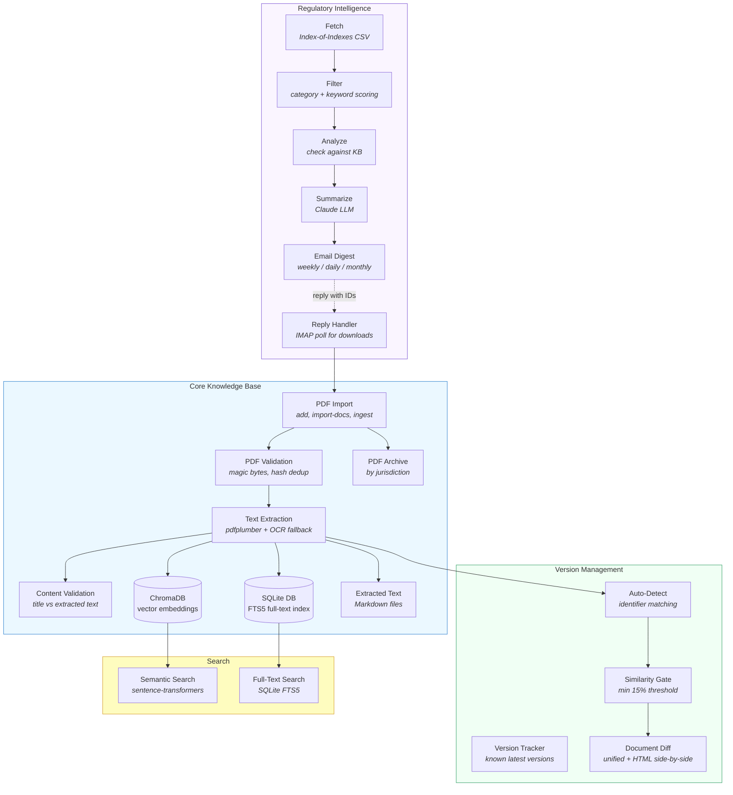

# Regulatory Knowledge Base (RegKB)

A local knowledge base for managing regulatory documents with natural language search, automated intelligence monitoring, and version tracking. Built for medical device regulatory affairs.

**Primary objective:** Stop re-downloading documents, find what you have instantly, and stay current on regulatory changes — all running locally.

## Architecture



## Features

### Document Management
- **Batch import** from directories with recursive scanning
- **Single add** from local file or URL
- **Pending inbox** (`pending/`) with folder-based metadata inference
- **SHA-256 deduplication** — never imports the same file twice
- **PDF validation** — magic byte checking, detects HTML error pages, ZIPs, images

### Text Extraction
- **pdfplumber** for native PDF text extraction to Markdown
- **OCR fallback** via Tesseract for scanned pages (auto-triggers when page text < 50 chars)
- **Batch OCR re-extraction** for existing documents

### Search
- **Semantic search** using sentence-transformers (`all-MiniLM-L6-v2`) + ChromaDB
- **Full-text search** via SQLite FTS5
- **Combined ranking** with filters by document type, jurisdiction, date range
- Latest-version-only by default

### Version Control
- **Known version tracking** against a reference database of current regulatory document versions
- **Auto-detection on import** — when a new document matches an existing identifier (MDR 2017/745, ISO 13485, MDCG 2019-11, etc.), the system detects the prior version automatically
- **Document diff** — unified and side-by-side HTML comparison with change statistics
- **Similarity gate** — auto-supersession requires configurable minimum similarity (default 15%) to prevent wrongful replacement
- **Content validation** — advisory check that extracted text matches the claimed title (catches wrong PDFs)

### Gap Analysis
- **Reference checklist** of essential regulatory documents by jurisdiction
- **Gap report** showing what's missing from the KB
- **Acquisition list** with official download URLs
- **Automated download** of freely available documents

### Regulatory Intelligence
- **Newsletter monitoring** — fetches from Index-of-Indexes (regulatory update aggregator)
- **Content filtering** — configurable category/keyword rules, medical device focus, pharma exclusion with combination device override
- **KB integration** — checks new entries against existing documents, queues downloads for approval
- **LLM summarization** — Claude-powered layperson summaries (what happened, why it matters, action needed)
- **Email digests** — weekly, daily alerts, monthly compilations via SMTP with HTML formatting
- **Reply-to-download** — reply to a digest email with entry IDs to trigger document download, URL resolution, import, and confirmation email
- **Scheduling** — Windows Task Scheduler XML and batch script generation

### Web Interface
- **FastAPI + Jinja2** — lightweight web UI at http://127.0.0.1:8000
- **Search** with HTMX live results and filters
- **Browse** documents with pagination, detail view, PDF download
- **Add** documents via upload, URL, or folder import
- **Statistics** dashboard with charts
- **Windows service** — runs always-on via NSSM with auto-restart

## Installation

### Prerequisites

- Python 3.9+
- pip
- (Optional) [Tesseract OCR](https://github.com/UB-Mannheim/tesseract/wiki) for scanned PDF support

### Setup

```bash
cd C:\Projects\RegulatoryKB
python -m venv .venv

# Windows
.venv\Scripts\activate

# Linux/Mac
source .venv/bin/activate

# Install
pip install -e .

# Optional: OCR support
pip install -e ".[ocr]"

# Full local development + test stack
pip install -e ".[dev,web,bot]"
```

### Environment Variables

Create a `.env` file in the project root (loaded automatically):

```
ANTHROPIC_API_KEY=sk-...       # Claude API key for LLM summaries
SMTP_USERNAME=you@gmail.com    # Gmail account for sending digests
SMTP_PASSWORD=xxxx-xxxx-xxxx   # Gmail app-specific password
```

IMAP credentials for reply processing default to the SMTP values, or set separately:

```
IMAP_USERNAME=you@gmail.com
IMAP_PASSWORD=xxxx-xxxx-xxxx
```

## Quick Start

```bash
# Import a folder of PDFs
regkb import-docs /path/to/pdfs --recursive

# Search your collection
regkb search "MDR Article 120 transition timeline"

# Add a document from a URL
regkb add https://example.com/guidance.pdf -t "MDCG 2024-5" --type guidance -j EU

# Compare two document versions
regkb diff 362 2 -o comparison.html

# Check what's missing from your KB
regkb gaps

# Run the full intelligence workflow
regkb intel run --email

# Start the web interface
regkb web --reload
```

## Web Interface

```bash
# Install web dependencies
pip install -e ".[web]"

# Run in development mode
regkb web --reload

# Run on custom port
regkb web --port 8080
```

### Windows Service (Always-On)

```bash
# Install NSSM
winget install NSSM.NSSM

# Run these as Administrator:
scripts\install-all-deps-global.bat   # Install deps to system Python
scripts\install-service.bat           # Create and start service
scripts\fix-pythonpath.bat            # Configure Python path
```

Service management:
```
nssm status RegKBWeb      # Check status
nssm restart RegKBWeb     # Restart
nssm stop RegKBWeb        # Stop
```

The web UI will be available at http://127.0.0.1:8000 and auto-start on boot.

## CLI Command Reference

### Document Management

| Command | Description |
|---------|-------------|
| `regkb import-docs SOURCE` | Import PDFs from a directory (recursive by default) |
| `regkb ingest` | Auto-import from `pending/` inbox (folder structure sets metadata) |
| `regkb add SOURCE` | Add a single document (file path or URL) |
| `regkb list` | List documents (filter by `--type`, `--jurisdiction`) |
| `regkb show ID` | Show document details |
| `regkb update ID` | Update document metadata |
| `regkb stats` | Knowledge base statistics |
| `regkb backup` | Create database backup |
| `regkb web` | Start web interface (`--reload` for dev, `--port 8000`) |

### Search & Extraction

| Command | Description |
|---------|-------------|
| `regkb search QUERY` | Natural language search (filter by `--type`, `--jurisdiction`) |
| `regkb reindex` | Rebuild search index |
| `regkb extract ID` | Re-extract text from a document (`--ocr` to force OCR) |
| `regkb ocr-reextract` | Batch OCR re-extraction (`--doc-id ID` or `--all`) |

### Version & Diff

| Command | Description |
|---------|-------------|
| `regkb diff ID1 ID2` | Compare two documents (`-o file.html` for side-by-side report) |
| `regkb versions` | Check all documents against known latest versions |

### Gap Analysis & Acquisition

| Command | Description |
|---------|-------------|
| `regkb gaps` | Identify missing documents against reference checklist |
| `regkb acquire` | Show recommended documents to acquire with URLs |
| `regkb download` | Download free documents from official sources |

### Regulatory Intelligence (`regkb intel`)

| Command | Description |
|---------|-------------|
| `intel fetch` | Fetch and filter regulatory updates |
| `intel sync` | Fetch, filter, and analyze against KB |
| `intel run` | Full workflow: fetch, filter, analyze, summarize, email |
| `intel summary` | Generate LLM summaries of recent updates |
| `intel email` | Send digest email (`--type weekly\|daily\|test`) |
| `intel pending` | List documents pending download approval |
| `intel approve IDS` | Approve pending downloads |
| `intel reject IDS` | Reject pending downloads |
| `intel download` | Download and import approved documents |
| `intel poll` | Poll IMAP for reply-based download requests |
| `intel resolve-url URL` | Test URL resolution (LinkedIn, social media) |
| `intel download-entry IDS` | Manually download specific digest entries |
| `intel digest-entries` | List tracked digest entries and status |
| `intel cache` | Manage LLM summary cache (`--clear`, `--stats`) |
| `intel status` | Show intelligence module configuration |
| `intel setup` | Generate automation scripts (batch, Task Scheduler XML) |
| `intel schedule-status` | Show scheduler state and next run times |

## Configuration

Edit `config/config.yaml` to customise:

| Section | Controls |
|---------|----------|
| `paths` | Directory locations (archive, extracted, database, pending) |
| `document_types` | Valid document types (guidance, standard, regulation, ...) |
| `jurisdictions` | Valid jurisdictions (EU, FDA, ISO, UK, ...) |
| `import` | Batch size, duplicate skipping, auto text extraction |
| `search` | Result limit, latest-only default, embedding model |
| `ocr` | OCR enable/disable, language, min text length, DPI |
| `versioning` | Minimum supersession similarity threshold (default 15%) |
| `intelligence.filters` | Category/keyword include/exclude rules |
| `intelligence.alerts` | Critical and high-priority keyword triggers |
| `intelligence.summarization` | LLM provider, model, style, max length |
| `intelligence.email` | SMTP server, sender, recipients, subject templates |
| `intelligence.schedule` | Weekly/daily/monthly timing |
| `intelligence.reply_processing` | IMAP server, poll interval, trusted domains |

## Directory Structure

```
RegulatoryKB/
├── archive/                  # Permanent PDF storage (by jurisdiction)
│   ├── EU/
│   ├── FDA/
│   ├── ISO/
│   └── ...
├── extracted/                # Markdown text extractions (ID.md)
├── db/
│   ├── regulatory.db         # Main SQLite database (FTS5)
│   ├── chroma/               # ChromaDB vector database
│   ├── backups/              # Database backups
│   ├── intelligence_pending.db
│   ├── intelligence_summaries.db
│   └── intelligence_digests.db
├── config/
│   └── config.yaml           # Configuration
├── logs/                     # Application logs
├── pending/                  # Auto-import inbox
│   ├── guidance/FDA/         # Folder structure = metadata
│   ├── standard/ISO/
│   └── processed/            # Successfully imported files
├── reports/
│   └── diffs/                # Generated HTML diff reports
├── scripts/
│   └── regkb/                # Python package
│       ├── cli.py            # CLI bootstrap + command registration
│       ├── config.py         # Configuration manager
│       ├── database.py       # SQLite operations
│       ├── extraction.py     # PDF text extraction + OCR
│       ├── importer.py       # Document import pipeline
│       ├── search.py         # Semantic + FTS search
│       ├── diff.py           # Document comparison
│       ├── version_diff.py   # Auto version detection + validation
│       ├── version_tracker.py# Known version checking
│       ├── gap_analysis.py   # Gap analysis
│       ├── acquisition_list.py
│       ├── reference_docs.py # Reference document checklist
│       ├── downloader.py     # Document downloader
│       ├── services.py       # Shared service access layer (lazy singleton access)
│       ├── commands/         # Modular Click command groups
│       │   ├── core.py       # Core document commands (`search`, `add`, `list`, etc.)
│       │   ├── lifecycle.py  # Import/extract/diff/gaps/download/web commands
│       │   └── intel.py      # `regkb intel` command group
│       ├── web/              # FastAPI web UI
│       │   ├── main.py       # App, middleware, routes
│       │   ├── dependencies.py
│       │   ├── routes/       # search, browse, documents, admin
│       │   ├── templates/    # Jinja2 HTML templates
│       │   └── static/       # CSS (Pico), JS (HTMX)
│       └── intelligence/     # Intelligence module
│           ├── fetcher.py    # Newsletter fetching
│           ├── filter.py     # Content filtering
│           ├── analyzer.py   # KB comparison
│           ├── summarizer.py # Claude LLM summaries
│           ├── emailer.py    # Email composition + SMTP
│           ├── digest_tracker.py
│           ├── url_resolver.py
│           ├── reply_handler.py
│           └── scheduler.py
├── .venv/                    # Python virtual environment
├── .env                      # Environment variables (not committed)
├── pyproject.toml
└── README.md
```

## Project Documentation

- [`Regulatory_KB_PRD.docx.md`](Regulatory_KB_PRD.docx.md) — Core system product requirements
- [`docs/PRD_Regulatory_Intelligence_Agent.md`](docs/PRD_Regulatory_Intelligence_Agent.md) — Intelligence module product requirements

## License

MIT License
